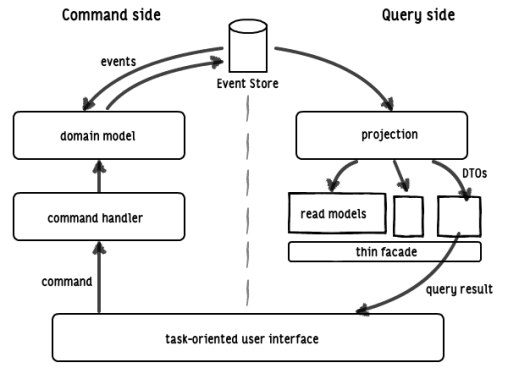
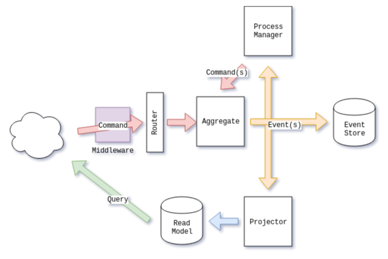

# BankAPI

This project is a simple HTTP API for a bank that will allow us to open and close accounts, deposit and withdraw funds and transfer them between accounts.

## Details

This is me trying to understand how event sourcing works in Elixir. Im following this excellent article named [Event Sourcing With Elixir](https://blog.nootch.net/post/event-sourcing-with-elixir/). Nice work from its author 👏👏👏!!!

I’m using the excellent [commanded](https://github.com/commanded/commanded) library for the article series, which is the center around building a very simple API for a bank.

Also, this project is covering:

- Aggregates
- Commands
- Events
- Projections
- Projectors
- Supervised process managers
- Routers
- Commanded middleware for auditing and validation
- Testing for the API’s functionality.

_Main entities in the Commanded library_

### To start your Phoenix server

- Install dependencies with `mix deps.get`
- Create and migrate your database with `mix ecto.setup`
- Start Phoenix endpoint with `mix phx.server` or inside IEx with `iex -S mix phx.server`

Ready to run in production? Please [check the deployment guides](https://hexdocs.pm/phoenix/deployment.html)
